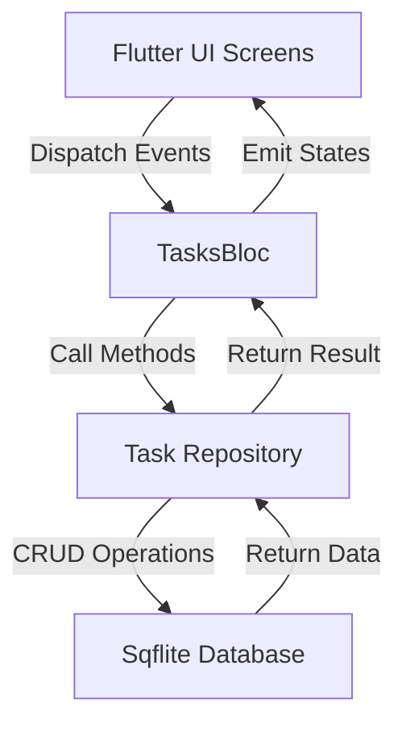
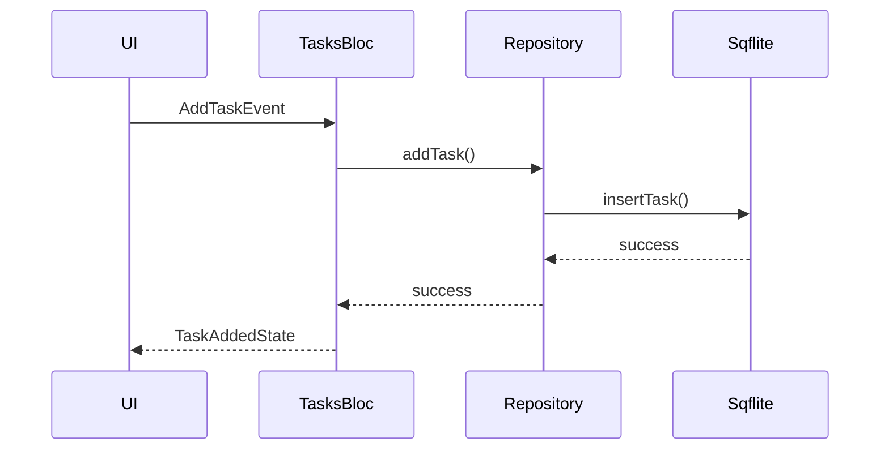

# 📝 Task Manager Pro

## 📌 Overview

The **Task Manager App** is a Flutter mobile application designed to help users efficiently manage their daily tasks. The app follows the **Bloc architecture** for scalable and predictable state management and includes comprehensive **error handling** to ensure a smooth and reliable user experience.

This project demonstrates clean architecture principles, modern Flutter practices, and testable business logic.

---

## 🚀 Features

* ➕ **Add New Tasks**
  Create tasks with title, description, start date, and end date.

* ✏️ **Edit & Delete Tasks**
  Modify or remove tasks easily.

* 🔍 **Search & Sort Tasks**

  * Search tasks using keywords
  * Sort tasks by date or completion status

* ⚠️ **Error Handling**
  Gracefully handles failures and displays meaningful error messages.

* 🧪 **Unit Tested**
  Core task operations are covered with unit tests.

---

## 🛠️ Tech Stack

* **Flutter** – Cross-platform mobile development
* **Bloc** – State management
* **Material Design** – Modern UI components

---

## 🧱 Architecture Overview

The application follows a layered architecture to ensure maintainability, scalability, and testability.

---

### 🔹 High-Level Architecture Diagram

```text
┌─────────────────────┐
│        UI Layer     │
│  Screens & Widgets  │
│  Flutter Material UI│
└───────────▲─────────┘
            │
            │ User Interaction
            ▼
┌─────────────────────┐
│     Bloc Layer      │
│  TasksBloc          │
│  TasksEvent         │
│  TasksState         │
└───────────▲─────────┘
            │
            │ Business Logic
            ▼
┌─────────────────────┐
│  Repository Layer   │
│  Task Repository    │
└───────────▲─────────┘
            │
            │ Data Access
            ▼
┌─────────────────────┐
│   Data Layer        │
│   Local Storage     │
│   (Sqflite / SQLite)│
└─────────────────────┘
```

---

### 🔄 Data Flow Diagram



---

### 🧠 Task Lifecycle (Add Task)



---

## 🧩 State Management

The app uses the **Bloc pattern** for clear separation of concerns.

### Core Components

* **TasksBloc**
  Handles all business logic and state transitions.

* **TasksEvent**
  Represents user-triggered actions such as:

  * Load tasks
  * Add task
  * Update task
  * Delete task

* **TasksState**
  Represents UI states:

  * Loading
  * Success
  * Failure

---

## ⚠️ Error Handling

Error handling is implemented across all task operations to ensure app stability.

### Failure States

* `LoadTaskFailure`
* `AddTaskFailure`
* `UpdateTaskFailure`

Each failure state provides detailed error information that is surfaced to the UI.

---

## 🧪 Unit Testing

Unit tests are implemented to ensure reliability and correctness of the core logic.

### Tested Scenarios

* Initial state validation
* Creating a new task
* Updating an existing task
* Deleting a task

---

## 🚀 Getting Started

### Prerequisites

* Flutter SDK installed
  👉 [https://docs.flutter.dev/get-started/install](https://docs.flutter.dev/get-started/install)
* Android / iOS emulator or physical device

---

### Installation

1. Clone the repository:

   ```bash
   git clone <repository-url>
   ```

2. Navigate to the project directory:

   ```bash
   cd task_manager_app
   ```

3. Install dependencies:

   ```bash
   flutter pub get
   ```

4. Run the app:

   ```bash
   flutter run
   ```

---

## 📈 Future Enhancements

* 🔔 Task reminders & notifications
* ☁️ Cloud synchronization
* 🌙 Dark mode
* 📊 Task analytics
* 🧪 Integration tests

---

## 🤝 Contributions

Contributions, issues, and feature requests are welcome.

---

⭐ **If you find this project useful, feel free to star the repository!**


